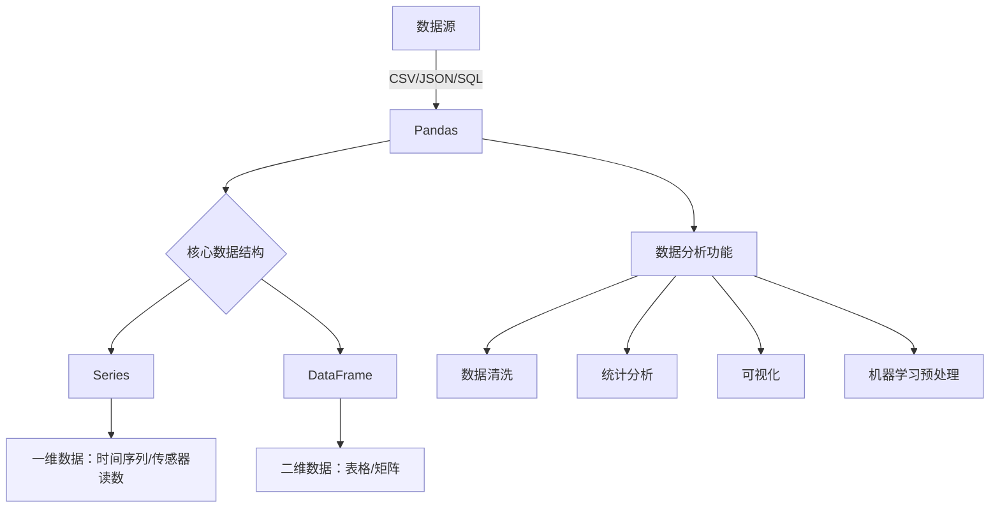

## 1. Pandas 简介
Pandas 是 Python 数据分析工具链中最核心的库，充当数据读取、清洗、分析、统计、输出的高效工具。

Pandas 提供了易于使用的数据结构和数据分析工具，特别适用于处理结构化数据，如表格型数据（类似于Excel表格）。

Pandas 是数据科学和分析领域中常用的工具之一，它使得用户能够轻松地从各种数据源中导入数据，并对数据进行高效的操作和分析。

|  特性  |        Series        |            DataFrame            |
| :--: | :------------------: | :-----------------------------: |
|  维度  |          一维          |               二维                |
|  索引  |         单索引          |            行索引 + 列名             |
| 数据存储 |       同质化数据类型        |            各列可不同数据类型            |
|  类比  |       Excel单列        |           整张Excel工作表            |
| 创建方式 | `pd.Series([1,2,3])` | `pd.DataFrame({'col':[1,2,3]})` |

## 2. Series

### 2.1 Series 的属性

| 属性           | 说明          | 属性     | 说明            |
| :----------- | :---------- | :----- | :------------ |
| index        | Series的索引对象 | loc[]  | 显式索引，按标签索引或切片 |
| values       | Series的值    | iloc[] | 隐式索引，按位置索引或切片 |
| dtype或dtypes | Series的元素类型 | at[]   | 使用标签访问单个元素    |
| shape        | Series的形状   | iat[]  | 使用位置访问单个元素    |
| ndim         | Series的维度   |        |               |
| size         | Series的元素个数 |        |               |
| name         | Series的名称   |        |               |

### 2.2 Series 的方法

| 方法                | 说明                     | 方法            | 说明                                         |
| :---------------- | :--------------------- | :------------ | :----------------------------------------- |
| head()            | 查看前 n 行数据，默认 5 行       | max()         | 最大值                                        |
| tail()            | 查看后 n 行数据，默认 5 行       | var()         | 方差                                         |
| isin()            | 判断元素是否包含在参数集合中         | std()         | 标准差                                        |
| isna()            | 判断是否为缺失值（如 NaN 或 None） | median()      | 中位数                                        |
| sum()             | 求和，自动忽略缺失值             | mode()        | 众数（可返回多个）                                  |
| mean()            | 平均值                    | quantile(q)   | 分位数，q 取 0~1 之间                             |
| min()             | 最小值                    | describe()    | 常见统计信息（count、mean、std、min、25%、50%、75%、max） |
| value_counts()    | 每个唯一值的出现次数             | sort_values() | 按值排序                                       |
| count()           | 非缺失值数量                 | replace()     | 替换值                                        |
| nunique()         | 唯一值个数（去重）              | keys()        | 返回 Series 的索引对象                            |
| unique()          | 获取去重后的值数组              |               |                                            |
| drop_duplicates() | 去除重复项                  |               |                                            |
| sample()          | 随机抽样                   |               |                                            |
| sort_index()      | 按索引排序                  |               |                                            |
- **统计计算类方法**：`sum()`、`mean()`、`max()`、`min()`、`std()` 等
- **缺失值处理**：`isna()`、`count()`
- **数据筛选与判断**：`isin()`、`unique()`、`nunique()`
- **排序与修改**：`sort_values()`、`sort_index()`、`replace()`
- **数据查看**：`head()`、`tail()`、`describe()`
- **抽样与去重**：`sample()`、`drop_duplicates()`
