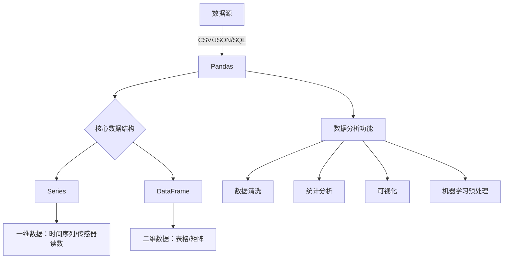

## 1. Pandas 简介
Pandas 是 Python 数据分析工具链中最核心的库，充当数据读取、清洗、分析、统计、输出的高效工具。

Pandas 提供了易于使用的数据结构和数据分析工具，特别适用于处理结构化数据，如表格型数据（类似于Excel表格）。

Pandas 是数据科学和分析领域中常用的工具之一，它使得用户能够轻松地从各种数据源中导入数据，并对数据进行高效的操作和分析。



|  特性  |        Series        |            DataFrame            |
| :--: | :------------------: | :-----------------------------: |
|  维度  |          一维          |               二维                |
|  索引  |         单索引          |            行索引 + 列名             |
| 数据存储 |       同质化数据类型        |            各列可不同数据类型            |
|  类比  |       Excel单列        |           整张Excel工作表            |
| 创建方式 | `pd.Series([1,2,3])` | `pd.DataFrame({'col':[1,2,3]})` |

## 2. Series

### 2.1 Series 的属性

| 属性           | 说明          | 属性     | 说明            |
| :----------- | :---------- | :----- | :------------ |
| index        | Series的索引对象 | loc[]  | 显式索引，按标签索引或切片 |
| values       | Series的值    | iloc[] | 隐式索引，按位置索引或切片 |
| dtype或dtypes | Series的元素类型 | at[]   | 使用标签访问单个元素    |
| shape        | Series的形状   | iat[]  | 使用位置访问单个元素    |
| ndim         | Series的维度   |        |               |
| size         | Series的元素个数 |        |               |
| name         | Series的名称   |        |               |

### 2.2 Series 的创建

| 创建方式 | 典型方法 | 说明 |
| :--- | :--- | :--- |
| 从列表创建 | `pd.Series([1,2,3])` | 默认索引为 0,1,2… |
| 自定义索引 | `pd.Series(data, index=…)` | 指定显式索引标签 |
| 指定名称 | `pd.Series(data, name=…)` | 给 Series 命名 |
| 从字典创建 | `pd.Series({'a':1,'b':2})` | 字典的 key 成为索引 |
| 从已有 Series 创建 | `pd.Series(s, index=…)` | 按新 index 过滤/重排，缺失项为 NaN |

**1. 从列表创建（默认索引 / 自定义索引 / 指定名称）**

```python
import pandas as pd

s = pd.Series([1, 2, 3, 4, 5])
print(s)
# 自定义索引
s = pd.Series([1, 2, 3, 4, 5], index=['A', 'B', 'C', 'D', 'E'])
print(s)
# 定义标签 name
s = pd.Series([1, 2, 3, 4, 5], index=['A', 'B', 'C', 'D', 'E'], name='月份')
print(s)
```

**2. 从字典 / 已有 Series 创建**

```python
# 通过字典来创建：字典的 key 作为索引
s = pd.Series({"a": 1, "b": 2, "c": 3, "d": 4, "e": 5})
print(s)
# 通过已有的 Series 来创建：按新 index 取值
s1 = pd.Series(s, index=["a", "c"])
print(s1)
```

### 2.3 Series 的属性访问

> `index`、`values`、`shape`、`ndim`、`size`、`dtype`、`name` 为属性；`loc[]`、`iloc[]`、`at[]`、`iat[]` 为访问器（见 2.1 属性表）。

```python
# series 的属性
print(s.index)            # 索引对象
print(s.values)           # 值数组
print(s.shape, s.ndim, s.size)   # 形状、维度、元素个数
s.name = "test"           # 可直接修改 name
print(s.dtype, s.name)

print(s.loc['a'])         # 显式索引获取元素
print(s.iloc[1])          # 隐式索引获取元素
# 使用显式/隐式索引进行切片获取
print(f"使用显式索引获取元素：\n{s.loc['a':'c']}")   # 含右端点
print(f"使用隐式索引获取元素：\n{s.iloc[1:3]}")      # 左闭右开
# 使用 at[] 和 iat[] 获取单个元素（无法进行切片）
print(s.at['a'])
print(s.iat[0])
```

> **切片区别**：`loc['a':'c']` 显式索引切片**包含右端点**；`iloc[1:3]` 隐式索引切片**左闭右开**，与 Python 切片一致。

**keys() 方法与 index 属性**

```python
# 获取索引：keys() 是方法，index 是属性，结果一致
print(s.keys())   # 方法
print(s.index)    # 属性
```

### 2.4 Series 的访问与修改

| 访问方式 | 用法 | 说明 |
| :--- | :--- | :--- |
| 标签索引 | `s['a']` | 按显式索引取单个值 |
| 布尔索引 | `s[s < 3]` | 按条件筛选元素 |
| 新增元素 | `s['f'] = 6` | 通过新标签赋值追加元素 |
| 切片访问 | `s.loc['a':'c']` / `s.iloc[1:3]` | 见 2.3 |

```python
# 访问数据
print(s['a'])
# 使用布尔索引访问数据
print(s[s < 3])
s['f'] = 6                # 新增元素
print(s.head())           # 取出数据的前 5 行
print(s.tail())           # 取出数据的后 5 行
```

### 2.5 Series 的方法

| 方法                | 说明                     | 方法            | 说明                                         |
| :---------------- | :--------------------- | :------------ | :----------------------------------------- |
| head()            | 查看前 n 行数据，默认 5 行       | max()         | 最大值                                        |
| tail()            | 查看后 n 行数据，默认 5 行       | var()         | 方差                                         |
| isin()            | 判断元素是否包含在参数集合中         | std()         | 标准差                                        |
| isna()            | 判断是否为缺失值（如 NaN 或 None） | median()      | 中位数                                        |
| sum()             | 求和，自动忽略缺失值             | mode()        | 众数（可返回多个）                                  |
| mean()            | 平均值                    | quantile(q)   | 分位数，q 取 0~1 之间                             |
| min()             | 最小值                    | describe()    | 常见统计信息（count、mean、std、min、25%、50%、75%、max） |
| value_counts()    | 每个唯一值的出现次数             | sort_values() | 按值排序                                       |
| count()           | 非缺失值数量                 | replace()     | 替换值                                        |
| nunique()         | 唯一值个数（去重）              | keys()        | 返回 Series 的索引对象                            |
| unique()          | 获取去重后的值数组              |               |                                            |
| drop_duplicates() | 去除重复项                  |               |                                            |
| sample()          | 随机抽样                   |               |                                            |
| sort_index()      | 按索引排序                  |               |                                            |
| idxmax()         | 最大值对应的索引            | idxmin()      | 最小值对应的索引                              |
| nlargest(n)      | 最大的 n 个值              | nsmallest(n)  | 最小的 n 个值                                |
| diff()           | 差分：当前元素与前一个元素之差     | pct_change()  | 百分比变化（环比增长率）：当日/前一日 - 1            |
| keys()           | 返回 Series 的索引对象        |               |                                            |
| resample()       | 按时间频率重新采样并聚合（需时间索引）   | rolling(n)    | 滑动窗口，对连续 n 个元素做聚合（如 sum、mean）        |
| between_time()   | 按时间段筛选（需 DatetimeIndex） |               |                                            |
- **统计计算类方法**：`sum()`、`mean()`、`max()`、`min()`、`std()` 等
- **缺失值处理**：`isna()`、`count()`
- **数据筛选与判断**：`isin()`、`unique()`、`nunique()`
- **排序与修改**：`sort_values()`、`sort_index()`、`replace()`
- **数据查看**：`head()`、`tail()`、`describe()`
- **抽样与去重**：`sample()`、`drop_duplicates()`

**常用方法代码示例**

```python
import numpy as np
np.random.seed(0)
s = pd.Series(np.random.randint(1, 21, 8), index=list("ABCDEFGH"), name='data')
print(s)

print(s.head(3))      # 默认前 5 行，可指定 n
print(s.tail(4))      # 默认后 5 行，可指定 n
print(s.describe())    # 描述性统计
print(s.count())      # 非缺失值数量
print(s.keys())       # 索引对象（等价于 s.index）

print(s.isna())       # 是否为缺失值
print(s.isin([4, 2, 8]))  # 元素是否在参数集合中

print(s.mean(), s.std(), s.var(), s.median())   # 均值、标准差、方差、中位数
print(s.quantile())   # 默认中位数；等价于 s.median()，可求任意分位数
print(s.mode())       # 众数（可能多个）
print(s.value_counts())  # 每个唯一值的出现次数

# 去重：drop_duplicates 返回 Series，unique 返回数组，nunique 返回个数
print(s.drop_duplicates())
print(s.unique())
print(s.nunique())

# 排序
print(s.sort_index())     # 按索引排序
print(s.sort_values())    # 按值排序
```

**最值索引与差分、变化率**

```python
print(s.idxmax())      # 最大值对应的索引
print(s.idxmin())      # 最小值对应的索引
print(s.nlargest(3))   # 最大的 3 个值
print(s.nsmallest(3))  # 最小的 3 个值
print(s.diff())        # 差分：当前值 - 前一个值
print(s.pct_change())  # 环比变化率：(当前 - 前一个) / 前一个
```

> **quantile 计算原理**（以某序列 2、3、4、5、10 为例，求 80% 分位数）：先算区间数 `n - 1 = 4`，位置 `4 × 0.8 = 3.2`，落在 5 与 10 之间，结果 `5 + (10 - 5) × 0.2 = 6`。

### 2.6 Series 时间序列方法

> 当 Series 的索引为 `DatetimeIndex` 时，可使用重采样、滑动窗口、时间段筛选等时间序列方法。

```python
# 重采样：按指定时间频率分组并聚合（如按季度 QE、按天 D）
sales = pd.Series([120, 135, 145, 160, 155, 170, 180, 175, 190, 200, 210, 220],
                  index=pd.date_range('2022-01-01', periods=12, freq='MS'))
print(sales.resample("QE").mean())   # 每季度平均销量

# 滑动窗口：对连续 n 个元素做聚合
grow = sales.pct_change()
increase = grow > 0
print(increase.rolling(3).sum())      # 连续 3 个月的增长情况

# 按时间段筛选（需 DatetimeIndex）
hourly_sales = pd.Series(np.random.randint(0, 100, 24),
                        index=pd.date_range('2025-01-01', periods=24, freq='h'))
print(hourly_sales.between_time('8:00', '22:00'))   # 筛选营业时间数据
print(hourly_sales.nlargest(3))      # 销售额最高的 3 个小时
```

### 2.7 实战案例

**案例 1：学生成绩统计**（来自 Pandas学习.ipynb）

> 创建一个包含 10 名学生数学成绩的 Series，成绩范围在 50-100 之间。
> - 计算平均分、最高分、最低分，并找出高于平均分的学生人数。

```python
np.random.seed(42)
scores = pd.Series(np.random.randint(50, 101, 10), index=["学生" + str(i) for i in range(1, 11)])
print(f"平均分：{scores.mean()}，最高分：{scores.max()}，最低分：{scores.min()}")
# 高于平均分的学生人数：count() / len() / .size 均可
mean = scores.mean()
print(scores[scores > mean].count())
print(len(scores[scores > mean]))
print(scores[scores > mean].size)
```

**案例 2：一周温度分析**（来自 Pandas学习.ipynb）

> 给定某城市一周每天的最高温度 Series：
> - 找出温度超过 30 度的天数
> - 计算平均温度
> - 将温度从高到低排序
> - 找出温度变化最大的两天

```python
temperatures = pd.Series([28, 31, 29, 32, 30, 27, 33],
                         index=['周一', '周二', '周三', '周四', '周五', '周六', '周日'])
print(f"温度超过30度的天数为：{temperatures[temperatures > 30].count()}")
print(temperatures.mean())                                    # 平均温度
print(temperatures.sort_values(ascending=False))             # 从高到低排序
# diff() 计算 Series 的变化值，取变化最大的两天
t3 = abs(temperatures.diff())
print(f"温度变化最大的两天：{t3.sort_values(ascending=False).index[:2].tolist()}")
```

**案例 3：股票收益率与波动率**（来自 Pandas学习.ipynb）

> 给定某股票连续 10 个交易日的收盘价 Series：
> - 计算每日收益率（当日收盘价 / 前日收盘价 - 1）
> - 找出收益率最高和最低的日期
> - 计算波动率（收益率的标准差）

```python
prices = pd.Series([102.3, 103.5, 105.1, 104.8, 106.2, 107.0, 106.5, 108.1, 109.3, 110.2],
                   index=pd.date_range('2023-01-01', periods=10))
pct = prices.pct_change()        # 每日收益率
print(pct.idxmax())             # 收益率最高的日期
print(pct.idxmin())             # 收益率最低的日期
print(pct.std())                # 波动率
```

**案例 4：销售数据重采样**（来自 Pandas学习.ipynb）

> 某产品过去 12 个月的销售量 Series：
> - 计算季度平均销量（每 3 个月为一个季度）
> - 找出销量最高的月份
> - 计算月环比增长率
> - 找出连续增长超过 2 个月的月份

```python
sales = pd.Series([120, 135, 145, 160, 155, 170, 180, 175, 190, 200, 210, 220],
                  index=pd.date_range('2022-01-01', periods=12, freq='MS'))
print(sales.resample("QE").mean())          # 季度平均销量
print(sales.idxmax())                       # 销量最高的月份
print(sales.pct_change())                   # 月环比增长率
# 连续增长超过 2 个月
grow = sales.pct_change()
increase = grow > 0
print(increase[increase.rolling(3).sum() >= 3].index.tolist())
```

## 3. DataFrame

### 3.1 DataFrame的属性

| 属性      | 说明             | 属性     | 说明              |
| ------- | -------------- | ------ | --------------- |
| index   | DataFrame的行索引  | loc[]  | 显式索引，按行列标签索引或切片 |
| values  | DataFrame的值    | iloc[] | 隐式索引，按行列位置索引或切片 |
| dtypes  | DataFrame的元素类型 | at[]   | 使用行列标签访问单个元素    |
| shape   | DataFrame的形状   | iat[]  | 使用行列位置访问单个元素    |
| ndim    | DataFrame的维度   | T      | 行列转置            |
| size    | DataFrame的元素个数 |        |                 |
| columns | DataFrame的列标签  |        |                 |

### 3.2 DataFrame 的创建

| 创建方式     | 典型方法                                       | 说明                          |
| :------- | :----------------------------------------- | :-------------------------- |
| 从字典创建    | `pd.DataFrame({'col': [...]})`             | 字典的 key 成为列名，最常用            |
| 从嵌套列表创建  | `pd.DataFrame([[...], [...]], columns=[])` | 每个子列表为一行，需手动指定列名            |
| 从字典列表创建  | `pd.DataFrame([{...}, {...}])`             | 每个字典为一行，key 为列名（JSON 常见结构）  |
| 从文件读取    | `pd.read_csv()` / `pd.read_json()`          | 见 4. 数据的导入与导出               |

```python
import pandas as pd

# 1. 从字典创建：key 作为列名
data = {
    "name": ['alice', 'alice', 'bob', 'alice', 'jack', 'bob'],
    "age": [26, 25, 30, 25, 35, 30],
    "city": ['NY', 'NY', 'LA', 'NY', 'SF', 'LA']
}
df = pd.DataFrame(data)

# 2. 从嵌套列表创建：每个子列表是一行，columns 指定列名
df = pd.DataFrame([[1, 2, 3], [4, 5, 6], [7, 8, 9]],
                  columns=['第一列', '第二列', '第三列'])
```

### 3.3 DataFrame 的数据概览

| 方法 / 属性                | 说明                                    |
| :-------------------- | :------------------------------------ |
| `head(n)` / `tail(n)` | 查看前 / 后 n 行，默认 5 行                    |
| `info()`              | 行数、列名、非空数量、每列类型、内存占用                  |
| `describe()`          | 数值列描述性统计（count、mean、std、min、四分位、max）  |
| `dtypes`              | 每列的数据类型                               |
| `isna().sum()`        | 每列的缺失值数量                              |
| `value_counts()`      | 某列各取值的出现次数                            |

```python
df = pd.read_csv('data/sleep.csv')
df.head(5)        # 前 5 行，先看数据长相
df.info()         # 结构概览：非空计数 + 类型 + 内存占用
df.describe()     # 数值列的描述性统计
df.dtypes         # 每列类型
df.isna().sum()   # 每列缺失值数量
df['bmi_category'].value_counts()   # 分类列的频次统计
```

> **拿到新数据的固定动作**：`head()` 看长相 → `info()` 看结构与缺失 → `describe()` 看数值分布 → `value_counts()` 看分类分布。

## 4. 数据的导入与导出

| 场景      | 方法                   | 常用参数                                            |
| :------ | :------------------- | :---------------------------------------------- |
| 读取 CSV  | `pd.read_csv(path)`  | `encoding`、`parse_dates`、`index_col`、`usecols`  |
| 导出 CSV  | `df.to_csv(path)`    | `index=False` 不写出行索引、`encoding`                 |
| 读取 JSON | `pd.read_json(path)` | 结构嵌套时字段识别可能不正常                                  |
| 读取 Excel | `pd.read_excel(path)` | `sheet_name` 指定工作表                             |

```python
import pandas as pd

# 数据的导入
df = pd.read_csv('data/employees.csv', encoding='utf-8')
print(df.salary.mean())

# 数据的导出
df.tail(10).to_csv('output/employees_tail.csv', index=False)
```

**JSON 数据的读取**（做爬虫会用到）

```python
# 直接 read_json：能读出 DataFrame，但结构嵌套时字段识别不正常
df = pd.read_json('data/test.json')
print(type(df))

# 更稳妥：先用 json 模块加载成字典，再取出目标层级构造 DataFrame
import json
with open('data/test.json', encoding='utf-8') as f:
    data = json.load(f)
print(type(data))                  # dict
df = pd.DataFrame(data['users'])   # users 是字典列表，每个元素为一行
```

> **提示**：`to_csv` 默认会把行索引写成一列，重新读取时会多出 `Unnamed: 0`，通常加 `index=False`。

## 5. 数据清洗


### 5.1 缺失值的识别

> Pandas 中 `np.nan`、`None`、`pd.NA` 三种都视为缺失值。

| 方法                    | 说明                                     |
| :-------------------- | :------------------------------------- |
| `isna()` / `isnull()` | 完全等价，`True` 表示缺失                       |
| `notna()` / `notnull()` | 与上面相反，`True` 表示非缺失                     |
| `isna().sum()`        | Series 得到缺失总数；DataFrame 得到**每列**缺失数量   |

```python
import pandas as pd
import numpy as np

s = pd.Series([1, 2, 3, np.nan, 5, None, pd.NA])
df = pd.DataFrame([[1, 2, 3], [4, np.nan, 6], [7, None, pd.NA]],
                  columns=['第一列', '第二列', '第三列'])

print(s.isna())        # True 表示缺失值
print(s.isnull())      # 与 isna() 等价
print(df.isna())
print(s.isna().sum())  # 缺失值的总数量
print(df.isna().sum())  # 每列的缺失值数量
```

### 5.2 缺失值的剔除

| 参数                | 说明                       |
| :---------------- | :----------------------- |
| 默认（`how='any'`）   | 一行内只要有缺失值，整行被剔除          |
| `how='all'`       | 一行内全是缺失值，整行才被剔除          |
| `thresh=n`        | 至少有 n 个非缺失值，整行才会保留       |
| `axis=1`          | 按列处理：一列内有缺失值，整列被剔除       |
| `subset=['列名']`   | 只依据指定列判断，该列缺失则剔除对应行      |
| `inplace=True`    | 原地修改，不返回新对象              |

```python
print(s.dropna())
print(df.dropna())                  # 一行内有缺失值，整行会被剔除
print(df.dropna(how='all'))         # 一行内全是缺失值，整行才被剔除
print(df.dropna(thresh=2))          # 至少有 2 个非缺失值，整行才保留
print(df.dropna(axis=1))            # 一列内有缺失值，整列会被剔除
print(df.dropna(subset=['第二列']))   # 第二列有缺失值，则那一行被剔除
```

> **整列缺失过多**时不必逐行剔除，直接删除该列更合适：`df.drop(columns='sleep_disorder', inplace=True)`。

### 5.3 缺失值的填充

| 方法                            | 说明                     |
| :---------------------------- | :--------------------- |
| `fillna(value)`               | 用固定值填充所有缺失值            |
| `fillna({'列名': 值})`           | 用字典按列指定填充值             |
| `fillna(df[['列名']].mean())`    | 用该列平均值填充（中位数用 `median()`） |
| `ffill()`                     | 用**前**一个值填充（forward fill） |
| `bfill()`                     | 用**后**一个值填充（backward fill） |

```python
df = pd.read_csv('data/weather_withna.csv', encoding='utf-8')
print(df.isna().sum())                       # 查看每列缺失值的数量

print(df.fillna({'temp_max': 20}).tail())    # 使用字典按列填充固定值
print(df.fillna(df[['wind']].mean()).tail())  # 用平均值填充 wind 列
print(df.ffill().tail())                     # 用前一个值填充
print(df.bfill().tail())                     # 用后一个值填充
```

> **选择填充策略**：数值列常用均值 / 中位数；时间序列常用 `ffill()`（延续上一时刻的观测）；分类列常用众数或填 `"未知"`。

### 5.4 重复值的处理

| 方法                                 | 说明                        |
| :--------------------------------- | :------------------------ |
| `duplicated()`                     | 整条记录完全相同则标记为重复，返回 `True`  |
| `drop_duplicates()`                | 删除重复记录，默认保留第一条            |
| `drop_duplicates(subset=['列名'])`   | 只根据指定列判断是否重复              |
| `keep='last'`                      | 保留最后一条，即以最新数据为准           |
| `keep=False`                       | 所有重复项全部删除                 |

```python
df.duplicated()                                      # 标记完全重复的记录
df.drop_duplicates()                                 # 删除重复记录，保留第一条
df.drop_duplicates(subset=['name'])                  # 根据指定列去重
df.drop_duplicates(subset=['name'], keep='last')     # 指定列去重，以最新数据为准
```

### 5.5 数据类型的转换

| 方法                        | 说明                            |
| :------------------------ | :---------------------------- |
| `astype('int16')`         | 转为指定数值类型，可显著降低内存占用            |
| `astype('category')`      | 转为分类类型，重复值多的字符串列节省内存且便于分组     |
| `map({...})`              | 按字典映射取值，常用于转布尔值或编码            |
| `pd.to_datetime()`        | 转为日期类型（见 7. 时间数据的处理）          |
| `str.split(expand=True)`  | 字符串拆分为多列（见 6.2 字符串分列）         |

```python
df = pd.read_csv('data/sleep.csv', encoding='utf-8')
df.dtypes                                    # 先查看原始类型

df['age'] = df['age'].astype('int16')        # 转换为整数类型，缩小内存
df.gender = df.gender.astype('category')     # 转换为分类类型

# 用 map 做映射：Female -> False，Male -> True
df['is_male'] = df['gender'].map({'Female': False, 'Male': True})
```

## 6. 数据变形与重构

### 6.1 宽表与长表（melt / pivot）

| 方法          | 方向    | 关键参数                                            |
| :---------- | :---- | :---------------------------------------------- |
| `pd.melt()` | 宽表→长表 | `id_vars` 固定不转换的列、`var_name` 新列名、`value_name` 新值列名 |
| `pd.pivot()` | 长表→宽表 | `index` 行索引、`columns` 列来源、`values` 值来源           |

```python
import pandas as pd

data = {
    'ID': [1, 2],
    'name': ['alice', 'bob'],
    'Math': [90, 85],
    'English': [88, 92],
    'Science': [95, 89]
}
df = pd.DataFrame(data)

# 宽表转长表：id_vars 固定列，var_name 转换后的列名，value_name 转换后的值列名
df2 = pd.melt(df, id_vars=['ID', 'name'], var_name='科目', value_name='分数')
df2.sort_values(by=['name'], inplace=True)

# 长表转宽表：可再接 reset_index() 把多级行索引还原成普通列
pd.pivot(df2, index=['ID', 'name'], columns='科目', values='分数')
```

> **长表 vs 宽表**：宽表（一行一个学生、一列一个科目）适合阅读展示；长表（一行一条“学生-科目-分数”记录）适合分组聚合与绘图。

### 6.2 字符串分列

```python
# expand=True 拆分成多列返回 DataFrame；expand=False 返回装着列表的 Series
df[['first_name', 'last_name']] = df['name'].str.split(' ', expand=True)

# 血压 "120/80" 拆成高压、低压两列，并转换为数值类型
df = pd.read_csv('data/sleep.csv', encoding='utf-8')
df[['高压', '低压']] = df['blood_pressure'].str.split('/', expand=True)
df[['高压', '低压']] = df[['高压', '低压']].astype('int16')
print(df[['高压', '低压']].dtypes)
```

> `str.split()` 拆出来的都是字符串，需要参与计算的必须再 `astype()` 转成数值类型。

### 6.3 数据分箱

`pd.cut(x, bins, labels)`：把连续数值切成若干区间（离散化）。

| 参数 / 方法              | 说明                                |
| :------------------- | :-------------------------------- |
| `x`                  | 要分箱的列                             |
| `bins=n`             | 等宽分成 n 段，起止值取该列的最小值与最大值           |
| `bins=[a, b, c]`     | 用列表自定义区间边界（左开右闭）                  |
| `labels=[...]`       | 为每个区间指定标签，数量需与区间数一致               |
| `pd.qcut(x, q)`      | **分位数**分箱，每个区间的样本数量大致相等           |

```python
import pandas as pd

df = pd.read_csv('data/employees.csv', encoding='utf-8')
df1 = df.head(10)[['employee_id', 'salary']].copy()

pd.cut(df1.salary, bins=2)                   # 等宽分成 2 段区间
pd.cut(df1.salary, bins=3).value_counts()    # 查看每个区间的数量

# 用列表指定区间：0 - 10000 - 20000 - 30000
pd.cut(df1.salary, bins=[0, 10000, 20000, 30000]).value_counts()
df1['收入范围'] = pd.cut(df1.salary, bins=[0, 10000, 20000, 30000],
                     labels=['低', '中', '高'])

pd.qcut(df1.salary, 3).value_counts()        # 分位数分箱，各区间样本数接近
```

```python
# 睡眠数据：把睡眠质量、年龄分箱
df = pd.read_csv('data/sleep.csv', encoding='utf-8')
df['睡眠质量等级'] = pd.qcut(df.sleep_quality, 3, labels=['睡眠质量低', '睡眠质量中', '睡眠质量高'])
df['睡眠质量等级'] = pd.cut(df.sleep_quality, bins=3, labels=['睡眠质量低', '睡眠质量中', '睡眠质量高'])
df['睡眠质量等级'].value_counts()

# 用业务含义划定区间：0-30 青年，30-60 中年，60+ 老年
df['age_level'] = pd.cut(df['age'], bins=[0, 30, 60, 120], labels=['青年', '中年', '老年'])
```

> **`cut` 与 `qcut` 的区别**：`cut` 等宽（区间长度相同，各组数量可能悬殊）；`qcut` 等频（各组数量接近，区间长度不一）。
>
> **统计分析的两条主线**：
> - 字符串 → 类别（`astype('category')`）→ 统计
> - 数值 → 分箱（`cut` / `qcut`）→ 统计
>
> **注意**：对切片得到的 DataFrame 直接新增列会触发 `SettingWithCopyWarning`，取子集时加 `.copy()` 更安全。

### 6.4 索引与列名的修改

| 方法                             | 说明                        |
| :----------------------------- | :------------------------ |
| `df.rename(columns={旧: 新})`    | 重命名列名（也可用 `index=` 重命名行索引） |
| `df.set_index('列名')`           | 把某一列设置为行索引                |
| `df.reset_index()`             | 把行索引还原成普通列，索引重置为 0,1,2…   |
| `df.index = [...]`             | 直接整体替换行索引                 |
| `df.columns = [...]`           | 直接整体替换列名（需与列数一致）          |

```python
df = pd.DataFrame({
    'name': ['jack', 'jill', 'james', 'jane', 'james'],
    'age': [20, 21, 22, 23, 24],
    'gender': ['male', 'female', 'male', 'female', 'male']
})

df.set_index('name', inplace=True)            # name 列变为行索引
df.reset_index(inplace=True)                  # 行索引还原成普通列
df.rename(columns={'age': '年龄'}, inplace=True)  # 重命名单个列

df.index = [1, 2, 3, 4, 5]                    # 整体替换行索引
df.columns = ['姓名', '年龄', '性别']              # 整体替换列名
```

> `inplace=True` 直接修改原对象并返回 `None`；不加则返回新对象，需要用变量接收。

## 7. 时间数据的处理

### 7.1 Timestamp 的属性与方法

| 属性                    | 说明          | 属性 / 方法             | 说明                |
| :-------------------- | :---------- | :------------------ | :---------------- |
| `year` `month` `day`  | 年、月、日       | `day_name()`        | 星期名称，如 Sunday     |
| `hour` `minute` `second` | 时、分、秒    | `to_period('D')`    | 转换为天周期            |
| `quarter`             | 季度          | `to_period('Q')`    | 转换为季度周期，如 2015Q2  |
| `weekday()`           | 星期（0=周一，6=周日） | `to_period('M')`  | 转换为月度周期，如 2015-05 |
| `is_month_end`        | 是否是月底       | `to_period('Y')` / `('W')` | 转换为年度 / 周周期  |

```python
d = pd.Timestamp('2015-05-31 10:22:00')
print(type(d))                       # <class 'pandas.Timestamp'>
print(d.year, d.month, d.day)
print(d.hour, d.minute, d.second)
print(f"季度：{d.quarter}")
print(f"星期：{d.weekday()}")          # 0 表示周一
print(f"是否是月底：{d.is_month_end}")

print(f"星期几：{d.day_name()}")        # Sunday
print(f"转换为季度：{d.to_period('Q')}")  # 2015Q2
print(f"转换为月度：{d.to_period('M')}")  # 2015-05
print(f"转换为周：{d.to_period('W')}")    # 2015-05-25/2015-05-31
```

### 7.2 字符串转日期与 dt 访问器

| 方式                                  | 说明                          |
| :---------------------------------- | :-------------------------- |
| `pd.to_datetime('2015-02-28')`      | 单个字符串转 `Timestamp`          |
| `pd.to_datetime(df['列'])`           | 整列字符串转日期类型                  |
| `pd.read_csv(..., parse_dates=['列'])` | 读取时直接把指定列解析为日期类型           |
| `Series.dt.xxx`                     | 日期类型的**列**通过 `.dt` 访问器取年月日等 |

```python
# DataFrame 整列日期转换
df = pd.DataFrame({'sales': [100, 200, 300],
                   'date': ['20150101', '20150102', '20150103']})
df['datetime'] = pd.to_datetime(df['date'])
print(df['datetime'].dt.year)
print(df['datetime'].dt.month)
print(df['datetime'].dt.day)
print(df['datetime'].dt.day_name())

# 读取 csv 时用 parse_dates 直接转换，省去后续处理
df = pd.read_csv('data/weather.csv', parse_dates=['date'])
df.info()      # date 列的 Dtype 为 datetime64
```

> **区别**：单个 `Timestamp` 直接用 `d.year`；一整列日期必须用 `s.dt.year`（`.dt` 是 Series 的日期访问器）。

### 7.3 日期索引与时间切片

```python
df = pd.read_csv('data/weather.csv', parse_dates=['date'])
# 把日期列设为索引后，才能按时间字符串切片；inplace=True 直接生效
df.set_index('date', inplace=True)
print(df.loc['2013-01':'2013-02'])   # 取 2013 年 1—2 月的数据
```

> **易错点**：忘记 `set_index('date')`，或索引不是 `DatetimeIndex` 时，按时间字符串切片会返回**空的 DataFrame**（不会报错），排查时先看 `df.index`。

### 7.4 时间间隔 Timedelta

```python
# 两个 Timestamp 相减得到 Timedelta
d1 = pd.Timestamp('2023-01-15')
d2 = pd.Timestamp('2023-02-23')
d3 = d2 - d1
print(type(d3))    # <class 'pandas.Timedelta'>
print(d3)          # 39 days 00:00:00
print(d3.days)     # 39

# 构造时间间隔列：表示距离第一天过了多少天，并作为索引切片
df = pd.read_csv('data/weather.csv', parse_dates=['date'])
df['delta'] = df['date'] - df['date'][0]
df.set_index('delta', inplace=True)
print(df.loc['10 days':'20 days'])
```

### 7.5 生成日期范围

`pd.date_range(start, end/periods, freq)`：生成 `DatetimeIndex`。

| 频率别名          | 含义             |
| :------------ | :------------- |
| `D`           | 每天             |
| `W`           | 每周（默认以周日为结束）   |
| `MS` / `ME`   | 每月初 / 每月末      |
| `QS` / `QE`   | 每季度初 / 每季度末    |
| `YS` / `YE`   | 每年初 / 每年末      |
| `h` `min` `s` | 每小时 / 每分钟 / 每秒 |

```python
# start + end 指定范围；start + periods 指定生成数量
days = pd.date_range(start='2023-01-15', end='2024-02-23', freq='W')
days = pd.date_range(start='2023-01-15', periods=10, freq='YS')
print(days)
```

> 新版 Pandas 中 `M`、`Q`、`Y` 已弃用，需写成 `ME`、`QE`、`YE`（月末、季末、年末），小时用小写 `h`。

### 7.6 重采样 resample

> 重采样 = 按时间频率重新分组 + 聚合，前提是索引为 `DatetimeIndex`。

```python
df = pd.read_csv('data/weather.csv', parse_dates=['date'])
df.set_index('date', inplace=True)

# 按年重新采样：每个年份最高温、最低温的平均值
df[['temp_max', 'temp_min']].resample('YE').mean()
```

> `resample` 与 `groupby` 的关系：`resample` 就是**按时间分组**的 `groupby`，同样支持 `mean()`、`sum()`、`max()`、`agg()` 等聚合。

## 8. 分组聚合

> 核心套路：`df.groupby('分组的字段')['聚合的字段'].聚合函数()`


### 8.1 groupby 基本用法

| 方法                     | 说明                     |
| :--------------------- | :--------------------- |
| `groupby('列').groups`  | 查看每个分组包含的行索引，用于确认分组结果  |
| `groupby('列').get_group(值)` | 取出某个具体分组的数据        |
| `groupby('列')['列'].mean()` | 单列聚合，返回 Series       |
| `groupby('列')[['列']].mean()` | 双层括号，返回 DataFrame   |
| `.reset_index()`       | 把分组字段从索引还原成普通列         |

```python
import pandas as pd

df = pd.read_csv('data/employees.csv')
# 分组字段有缺失值时先清洗，再转成整数类型，避免出现 90.0 这样的组名
print(df['department_id'].isna().sum())
df.dropna(subset=['department_id'], inplace=True)
df['department_id'] = df['department_id'].astype('int16')

print(df.groupby('department_id').groups)            # 查看分组：每个部门的索引
print(df.groupby('department_id').get_group(10))     # 查看某个分组的数据

# 计算不同部门的平均薪资
df2 = df.groupby('department_id')['salary'].mean().round(2).reset_index()
df2.sort_values('salary', ascending=False)
```

### 8.2 多字段分组

```python
# 计算不同部门、不同岗位的平均薪资
df3 = df.groupby(['department_id', 'job_id'])['salary'].mean().round(2)     # 单层括号 → Series
df3 = df.groupby(['department_id', 'job_id'])[['salary']].mean().round(2)   # 双层括号 → DataFrame
df3 = df3.reset_index()                          # 多级索引还原为列
df3.sort_values('salary', ascending=False)
```

> 多字段分组的结果是**多级索引**，`reset_index()` 后才便于排序、导出和继续分析。

### 8.3 agg 多指标聚合

| 写法                                       | 说明                    |
| :--------------------------------------- | :-------------------- |
| `.mean()`                                | 一次只能算一个指标             |
| `.agg(['mean', 'count', 'max', 'min'])`  | 对同一列一次性算多个指标          |
| `.agg({'列A': 'mean', '列B': 'sum'})`      | 不同列分别指定聚合函数           |
| `.agg({'列A': ['mean', 'count']})`        | 同一列多个指标，结果为多级列名       |

```python
# 只能算一种指标
df.groupby('sex')['body_mass_g'].mean()

# agg 一次性算多个指标：均值、数量、最大、最小
df.groupby('sex')['body_mass_g'].agg(['mean', 'count', 'max', 'min'])

# 按性别 + 岛屿分组，对体重同时求均值与数量
df.groupby(['sex', 'island']).agg({
    'body_mass_g': ['mean', 'count']
})

# 不同列分别指定聚合函数
df.groupby(['age_level', 'bmi_category']).agg({
    'sleep_duration': 'mean',
    'sleep_quality': 'mean',
    'stress_level': 'mean'
})
```

## 9. 综合实战案例

> 标准分析流程：**导入库 → 导入数据 → 数据清洗 → 特征构造 → 统计与分析**。

### 9.1 企鹅数据分析（来自 数据分析.ipynb）

```python
# 1. 导入必要库
import pandas as pd

# 2. 导入数据
df = pd.read_csv('data/penguins.csv')
df.head(5)
df.info()

# 3. 数据清洗：缺失值处理
print(df.isna().sum())      # 形态数据缺失 2 条，性别缺失 11 条
df.dropna(inplace=True)

# 4. 数据特征构造
df['sex'] = df['sex'].astype('category')
df['bill_ratio'] = df['bill_length_mm'] / df['bill_depth_mm']   # 喙长宽比

# 5. 数据分析
# 5.1 数据分箱：把体重分为低、中、高三个等级
labels = ['低', '中', '高']
df['mass_level'] = pd.cut(df['body_mass_g'], bins=3, labels=labels)
print(df['mass_level'].value_counts())

# 5.2 按性别、岛屿分组，统计体重均值与样本数
df.groupby(['sex', 'island']).agg({
    'body_mass_g': ['mean', 'count']
})
```

> **结论**：体重分箱后低、中、高分别为 150 / 128 / 55 只，整体偏轻；分组结果显示雄性企鹅普遍重于雌性，其中 Biscoe 岛雄性最重（约 5104 g），Torgersen 岛雌性最轻（约 3396 g）。

### 9.2 睡眠健康数据分析（来自 数据分析.ipynb）

```python
# 1. 导入库
import pandas as pd
import numpy as np

# 2. 导入数据
df = pd.read_csv('data/sleep.csv')
df.info()
df.describe()

# 3. 数据清洗：sleep_disorder 缺失过多（400 条中仅 110 条有值），直接删列
df.isna().sum()
df.drop(columns='sleep_disorder', inplace=True)

# 4. 数据特征构造
df['gender'] = df['gender'].astype('category')
df['occupation'] = df['occupation'].astype('category')
df['bmi_category'] = df['bmi_category'].astype('category')
df[['high', 'low']] = df['blood_pressure'].str.split('/', expand=True)   # 血压分列

labels = ['差', '中', '优']
df['sleep_quality_level'] = pd.cut(df['sleep_quality'], bins=3, labels=labels)
age_labels = ['青年', '中年', '老年']
df['age_level'] = pd.cut(df['age'], bins=[0, 30, 60, 120], labels=age_labels)

# 5. 数据的统计与分析
print(df['bmi_category'].value_counts())

# 按年龄段 + BMI 分组，观察睡眠时长、睡眠质量与压力水平
df.groupby(['age_level', 'bmi_category']).agg({
    'sleep_duration': 'mean',
    'sleep_quality': 'mean',
    'stress_level': 'mean'
})
```

> **分析要点**：字符串列转 `category` 后便于分组；连续变量（年龄、睡眠质量）分箱后才能做交叉分组统计；分组结果显示 BMI 为 Normal 的人群睡眠质量普遍较高、压力水平较低，而 Obese 老年人群压力水平最高。
