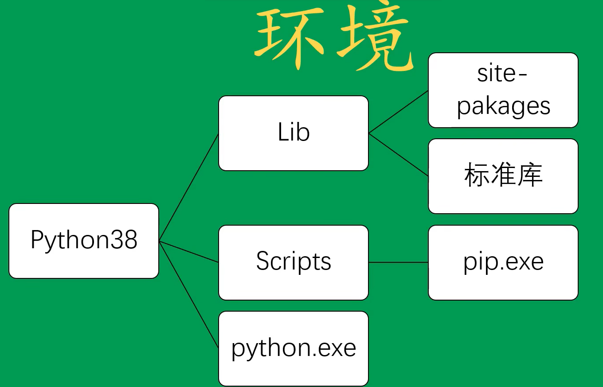
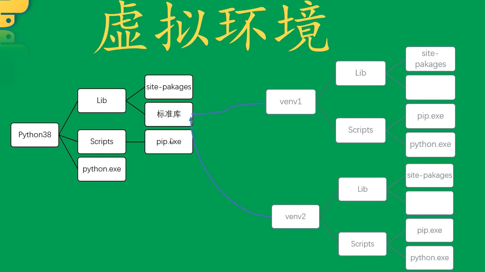
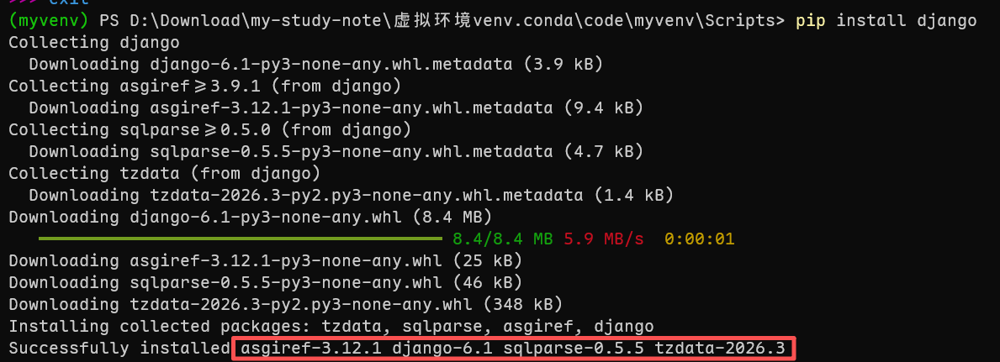
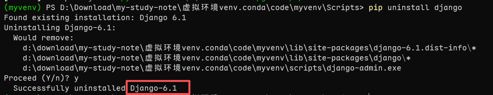
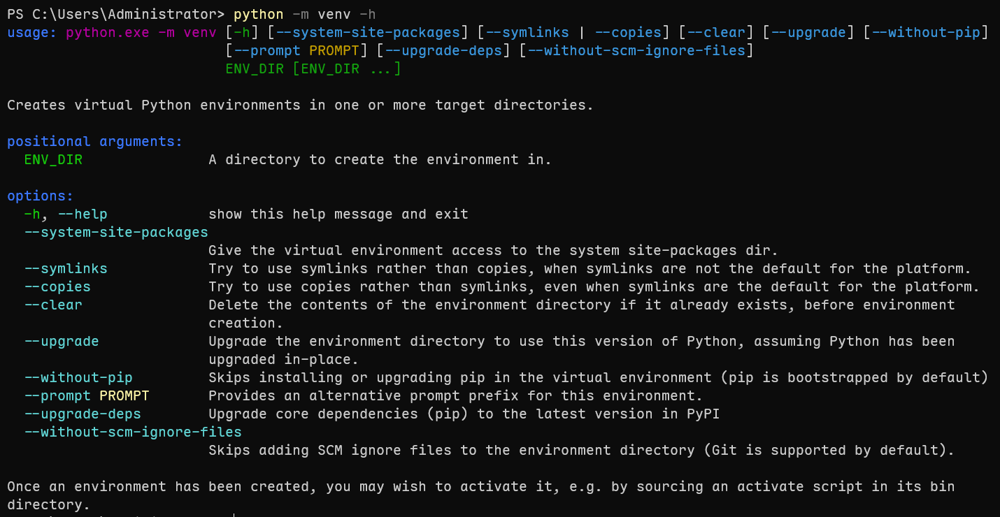
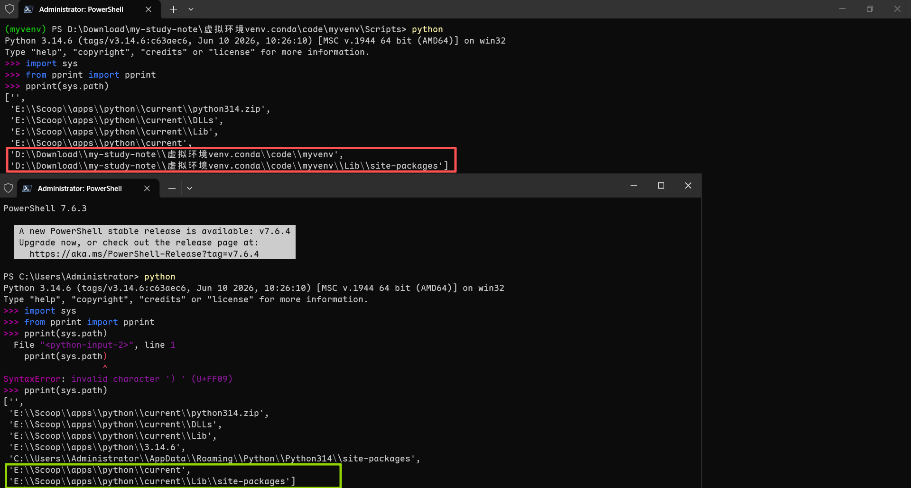
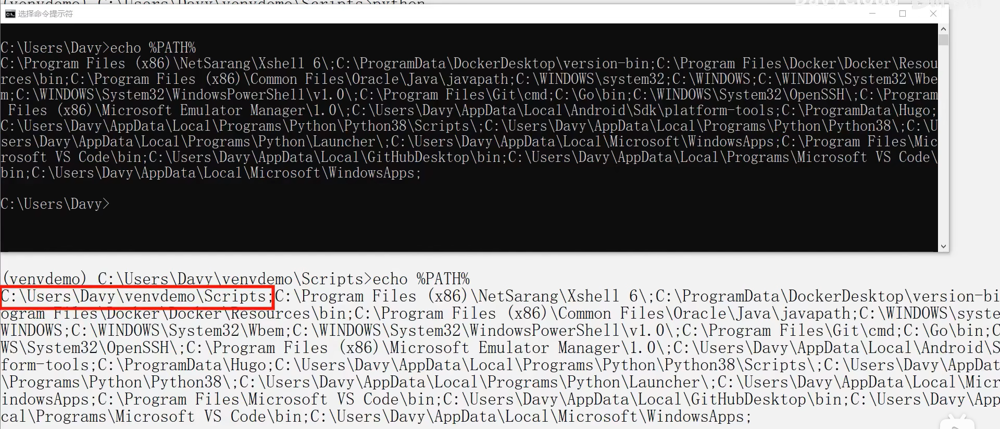

# Python 虚拟环境——venv 与 conda



虚拟环境：真实环境的一个副本

> 1. 虚拟环境中没有标准库，只有 `site-packages`
> 2. 可执行文件统一放在 `Scripts` 目录下
> 3. 标准库引用真实环境的标准库



## 为什么需要虚拟环境

安装包时不仅会安装需要的包，还会自动安装其依赖，包一多就容易产生版本冲突。

以安装 django 为例：

```
pip install django
pip uninstall django
```




可以看到 `pip install` 除了 django 还装了一堆依赖包，而 `pip uninstall django` 只卸载 django 本身，依赖包并不会被清理。

## venv

> 优质教程：[Venv](https://www.bilibili.com/video/BV1V7411n7CM?spm_id_from=333.788.videopod.episodes&vd_source=369d38169841ddab54fa190119c61a43)

### 1. 创建虚拟环境

```
python -m venv <虚拟环境名称>
```

`python -m venv -h` 可查看 venv 的帮助。



### 2. 激活虚拟环境

Windows：

```powershell
cd <虚拟环境名称>
cd Scripts
.\activate
```

macOS / Linux：

```bash
source <虚拟环境名称>/bin/activate
```

### 3. 退出虚拟环境
```shell
deactivate
```

### 4. 虚拟环境的本质

分别读取虚拟环境和真实环境中 `sys.path` 的差异：



再查看 `echo %PATH%`：



虚拟环境的本质：**复制基础环境，激活后将自身目录前置到 `PATH`，系统优先调用虚拟解释器，从而实现隔离**。

因此，虚拟环境并不强制要求激活——只要在命令行中把虚拟环境的 `Scripts`（或 `bin`）目录显式放在 `PATH` 前面，同样可以使用虚拟环境的解释器。

## 虚拟环境的封装（共享给他人）

1. 进入虚拟环境
2. `pip freeze`（把已安装的包按 `requirements` 格式输出）
3. `pip freeze > requirements.txt` 将环境保存到文件中
![[Pasted image 20260807132614.png]]
4. 把 `requirements.txt` 发给同事，对方执行：

```
pip install -r requirements.txt
```

即可复现一模一样的环境。

## Conda

> 一般安装的都是 **Miniforge**。

**Conda** 同样用于创建和管理虚拟环境，与 venv 相比它的优势是：能管理**非 Python 依赖**（由 C、C++、Fortran 等语言编译的库），并支持按环境导出/导入。

### 为什么需要 Conda：跨语言兼容性问题

像 **numpy** 这种底层由 C 和 Fortran 实现的库，不同的系统需要不同的二进制版本。**Anaconda** 公司会为每一个系统提前编译好对应的二进制版本，基本可以做到开箱即用，而不会出现 `pip` 那种"装得上但用不了"的编译问题。

### 基本命令

| 操作     | 命令                            |
| ------ | ----------------------------- |
| 创建虚拟环境 | `conda create -n <name>`      |
| 激活虚拟环境 | `conda activate <name>`       |
| 安装依赖   | `conda install <库名>`          |
| 退出环境   | `conda deactivate`            |
| 导出环境   | `conda env export > env.yml`  |
| 导入环境   | `conda env create -f env.yml` |

> **重要**：激活后才能往目标环境安装依赖。**如果没有激活就直接安装，依赖会被装进 `base` 环境**——`base` 是 Conda 自身运行的环境，不建议往里面乱装东西。

### 发行版与生态

从 **Anaconda** 精简出 **Miniconda**，再由开源社区发展出 **Miniforge**：

- **Anaconda**：完整发行版，自带大量预装包，安装体积大
- **Miniconda**：精简版，只包含 **conda** 命令和它运行所需的最基本依赖
- **conda-forge**：开源社区维护的 **channel**（软件源/频道），完全免费
- **Miniforge**：开源社区打造的安装包，与 Miniconda 基本一样，但默认配置指向免费的 **conda-forge** channel；而 Miniconda 默认指向 Anaconda 公司收费的 **defaults** channel

使用 conda-forge 源创建环境 / 安装依赖时，只需在命令中追加 `-c conda-forge` 指定 channel：

```
conda create -n <env_name> -c conda-forge
conda install -c conda-forge <pkg_name>
```

### Mamba：更快的 Conda

由于 conda 的下载速度过慢，开源社区使用 C++ 把 conda 中最慢的部分重新实现了一遍，这个"加强版"被称为 **Mamba**。

用法完全相同，只需将命令中的 `conda` 换成 `mamba`：

```
mamba create -n <env_name>
mamba install <pkg_name>
```

> 注意：**Mamba** 默认就包含在 **Miniforge** 的安装包中。